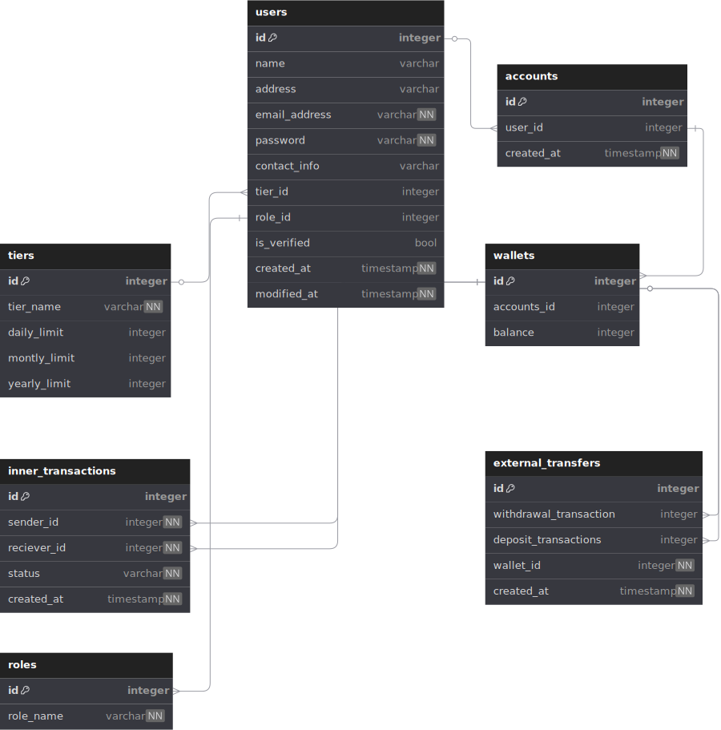

## About
An exercise in designing and implementing, being mindful of security, a fully functional Digital Wallet Platform using HTML, CSS, JavaScript, PHP, and MySQL with a focus on seamless integration between frontend and backend without the use of libraries (except Axios), frameworks, or AI generation tools. The required features include account creation (with roles, tiers, profile management, and idendity verification), wallets (with accounts with limits, deposit and withdraw feature, scheduled payments, QR code payments, and transaction history), push notifications, and third-party authentication (Google, Meta, etc...).

The backend is required to be served on an EC2 instance with certbot enabled and a scheduled database backup. The frontend on [GitHub Pages](https://pages.github.com/)

#### Disclaimer
The real challenge of this project is the time constraints; where we are given a deadline in `8 days, 23 hours, 29 minutes` out of which `45 hours` are of general lectures, leaving us with only `170 of hours of a deadline`. This is my progress given the time constraints.

#### Entity Relations

## Requirements
#### [PHP](https://www.php.net/) and [MySQLi](https://www.php.net/manual/en/book.mysqli.php) Library
###### Ubuntu
    apt-get install php php-mysql
###### MacOS
    brew install php
###### Windows
Refer to the [PHP Downloads Page](https://www.php.net/downloads.php)

##### Make sure MySQLi is enabled in [php.ini](https://www.php.net/manual/en/configuration.file.php)

#### [Apache](https://httpd.apache.org) HTTP Server
###### Ubuntu
    apt-get install apache2
###### MacOS
    brew install httpd
###### Windows
Download Apache HTTP Server from a [third-party vendor](https://httpd.apache.org/docs/current/platform/windows.html#down)

#### [MySQL](https://httpd.apache.org) Relational Database
###### Ubuntu
    apt install mysql-server
###### MacOS
    brew install mysql
###### Windows
Refer to the [installation instructions for Microsoft Windows](https://dev.mysql.com/doc/en/windows-installation.html)

## Setup
##### Setup DotEnv
Add a `.env` file in [server](./server) from the [example](./server/.env.example)
##### Configure Apache
##### Run The [Migrations](./server/database/migration/Migration.php)
###### Unix
    chmod +x server/database/migration/Migration.php && \
    php server/database/migration/Migration.php 
###### Windows
Refer to [this guide](https://letmegpt.com/?q=I%20have%20a%20migrations.php%20file.%20How%20can%20I%20check%20that%20MySQL%20is%20running%20on%20Windows%20and%20run%20that%20migration%20file%20with%20PHP%3F%20Please%20first%20check%20and%20show%20me%20how%20to%20add%20PHP%20to%20my%20env%20path.)

## API Endpoint Examples
`api/v2/Register.php`
##### curl
    curl --location 'http://13.38.64.121//api/v1/Register.php' \
    --header 'Content-Type: application/json' \
    --data-raw '{
        "email":"test1@gmail.com",
        "password":"testing"
    }'
##### Response
    {
        "message": "Success!",
        "data": null
    }

`api/v2/Login.php`
##### curl
    curl --location 'http://13.38.64.121//api/v1/Login.php' \
    --header 'Content-Type: application/json' \
    --data-raw '{
        "email":"<email>",
        "password":"<password>"
    }'
##### Response
    {
        "message": "Success!",
        "data": [
            "<token>"
        ]
    }
See also the [postman collection](.documentation/postman_collection.json) example

## Features
 - An [API Server](./server) written in raw PHP
 - A [FrontEnd](client) and [Admin Panel](admin) written in Vanilla JS and HTML/CSS
 - An authentication layer with Login and Registration
 - JWT [Generation](server/util/JWT.php) and [Validation](server/util/JWTValidator.php)
 - Token storage in Cookies
